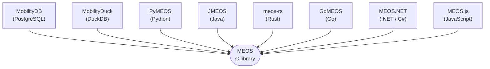

MEOS (Mobility Engine, Open Source) is a C library for temporal and spatiotemporal data — moving objects, time-varying values, and time spans / sets. Databases, query engines, and language bindings consume MEOS to expose temporal types in their respective environments.

The library is inspired by [GEOS](https://libgeos.org/) (Geometry Engine, Open Source) — hence the name.

## Standards alignment

MEOS implements published standards rather than ad-hoc representations:

* [**ISO 19141:2008**](https://www.iso.org/standard/41445.html) — *Geographic information — Schema for moving features.* MEOS extends it to also represent the evolution of non-spatial attributes and the *temporal gaps* inherent to real mobility data (periods during which no observations were collected, for instance due to signal loss).
* [**OGC Moving Features JSON**](https://docs.opengeospatial.org/is/19-045r3/19-045r3.html) — the canonical JSON encoding for moving features, an extension of [GeoJSON](https://geojson.org/). MEOS implements it as its [MF-JSON encoding](/movingfeaturesformats/mfjson/).
* **Well-Known Text** and **Well-Known Binary** — the same conventions used by [GEOS](https://libgeos.org/) and [PostGIS](https://postgis.net/), extended to the time dimension. See [WKT](/movingfeaturesformats/wkt/) and [WKB](/movingfeaturesformats/wkb/).

The encoding choice is up to the consumer; values move losslessly between the three so a binding can pick whichever fits its transport.

## Where MEOS is consumed

MEOS exposes its type system through bindings tailored to each host environment.

| Environment | Binding |
|---|---|
| PostgreSQL | [MobilityDB](https://mobilitydb.com) |
| DuckDB | [MobilityDuck](https://github.com/MobilityDB/MobilityDuck) |
| Python | [PyMEOS](https://github.com/MobilityDB/PyMEOS) |
| Java | [JMEOS](https://github.com/MobilityDB/JMEOS) |
| Rust | [meos-rs](https://github.com/MobilityDB/meos-rs) |
| Go | [GoMEOS](https://github.com/MobilityDB/GoMEOS) |
| .NET | [MEOS.NET](https://github.com/MobilityDB/MEOS.NET) |
| JavaScript | [MEOS.js](https://github.com/MobilityDB/MEOS.js) |

Each binding exposes the same MEOS type system using the conventions of its host environment: SQL functions in PostgreSQL/DuckDB, idiomatic classes in PyMEOS / JMEOS / meos-rs / GoMEOS / MEOS.NET / MEOS.js. The C library is the source of truth for type semantics, encoding, and behaviour.

## Architecture



Other consumers can be built directly on top of MEOS — additional language bindings, integrations with other DBMSs, or analytics platforms (Spark, Flink, Apache Beam, etc.). The MEOS C API is the common substrate.

## Quickstart

The same temporal value travels through every binding. Three thirty-second tastes:

### C (the library directly)

```c
#include <stdio.h>
#include <stdlib.h>
#include <meos.h>

int main(void) {
    meos_initialize();
    meos_initialize_timezone("UTC");

    Temporal *t = (Temporal *) tfloat_in(
        "[1.5@2026-01-01, 2.5@2026-01-02]");
    char *json = temporal_as_mfjson(t, true, 6, 1, NULL);
    printf("%s\n", json);

    free(json); free(t);
    meos_finalize();
    return 0;
}
```

Compile with `gcc -I/usr/local/include -lmeos hello.c -o hello`.

### Python (via PyMEOS)

```python
from pymeos import pymeos_initialize, TFloatSeq
pymeos_initialize()

t = TFloatSeq(string="[1.5@2026-01-01, 2.5@2026-01-02]")
print(t.as_mfjson())
```

Install with `pip install pymeos`.

### SQL (via MobilityDB on PostgreSQL)

```sql
CREATE EXTENSION mobilitydb CASCADE;

SELECT asMFJSON(tfloat '[1.5@2026-01-01, 2.5@2026-01-02]');
```

All three produce the same MF-JSON document — that's the point of the encoding-as-common-substrate model.

## Learn the basics

A nine-step tutorial series walks through the essence of the library. Several steps offer **variants** that swap an axis without changing the lesson — typically a different coordinate system (Cartesian vs. geodetic), a different input source (real-world AIS vs. synthetic BerlinMOD), or a different I/O target (in-process, DB, file). Pick the variant that matches your stack:

1. **Hello World** — first temporal point values and MF-JSON output.
   * [Cartesian](/tutorialprograms/01_hello_world/) — `tgeompoint` in a planar coordinate system.
   * Geodetic variant — `tgeogpoint` on the WGS84 sphere (`01_hello_world_geodetic.c`).
2. [AIS Read](/tutorialprograms/02_ais_read/) — parsing AIS observation records into temporal values.
3. **AIS / BerlinMOD Assemble** — building trajectories from streaming observations.
   * [AIS](/tutorialprograms/03_ais_assemble/) — real-world AIS data (Danish Maritime Authority feed).
   * BerlinMOD variant — synthetic data from the BerlinMOD generator (`03_berlinmod_assemble.c`).
4. **AIS Persist** — three variants for *where* the trajectories land:
   * [Bulk → DB](/tutorialprograms/04_ais_store/) — load a CSV file into MobilityDB in one shot.
   * [Stream → DB](/tutorialprograms/04_ais_stream_db/) — streaming DB ingest using MEOS expandable temporal structures, sending batches to MobilityDB as they fill.
   * Stream → File variant (`04_ais_stream_file.c`) — same expandable-structure streaming pattern, writing to an output file instead of a database.
5. [BerlinMOD Disassemble](/tutorialprograms/05_berlinmod_disassemble/) — splitting trips into instants.
6. [BerlinMOD Clip](/tutorialprograms/06_berlinmod_clip/) — restricting trajectories to spatial regions.
7. [BerlinMOD Tile](/tutorialprograms/07_berlinmod_tile/) — spatiotemporal tiling.
8. [BerlinMOD Simplify](/tutorialprograms/08_berlinmod_simplify/) — line-simplification of trajectories.
9. [BerlinMOD Aggregate](/tutorialprograms/09_berlinmod_aggregate/) — temporal aggregation.

The numbered series is intentionally simplified — small datasets, well-formed input, no error handling — so that the MEOS API is the focus of attention rather than the I/O scaffolding around it.

Some examples ship a `*_full.c` counterpart in [`meos/examples/`](https://github.com/MobilityDB/MobilityDB/tree/master/meos/examples) that handles real-world conditions: realistic file sizes, malformed inputs, edge cases, error recovery, retry / reconnect logic. **The convention is that `_full` counterparts exist only where the data has real-world messiness** — i.e. for examples that operate on a real AIS feed. The BerlinMOD examples (steps 5–9) operate on synthetic generator-produced data that's clean by construction, so they intentionally have no `_full` counterpart.

Current pairs:

* `03_ais_assemble.c` ↔ `ais_assemble_full.c`
* `ais_expand.c` ↔ `ais_expand_full.c`
* `ais_transform.c` ↔ `ais_transform_full.c`

Use the simplified example to learn the API; use the `_full` counterpart as a reference when wiring MEOS into production code.

Beyond the tutorial ladder, [`meos/examples/`](https://github.com/MobilityDB/MobilityDB/tree/master/meos/examples) also contains feature-specific examples: rtree indexing, k-means / DBSCAN clustering, projection, transforms, expansion, network points, and more.

## Encodings

MEOS defines stable on-the-wire encodings for temporal values, allowing data to round-trip between bindings without loss:

* [Well-Known Text (WKT)](/movingfeaturesformats/wkt/) — human-readable.
* [Well-Known Binary (WKB)](/movingfeaturesformats/wkb/) — compact binary, the canonical interchange format.
* [Moving-Features JSON (MF-JSON)](/movingfeaturesformats/mfjson/) — OGC-aligned JSON.

A trajectory written from one binding can be read by any other.

## Origin

A [first version](https://github.com/adonmo/meos) of MEOS, written in C++, was contributed by Krishna Chaitanya Bommakanti. The current C library evolved from that origin and has been the canonical implementation since.

## Acknowledgements


<p>
The MobilityDB project has received funding from the European Union's <a href="https://open-research-europe.ec.europa.eu/gateways/horizon-europe">Horizon Europe</a> research and innovation programme under grant agreements No 101070279 <a href="https://mobispaces.eu/" target="blank">MobiSpaces</a> and No 101093051 <a href="https://emeralds-horizon.eu/" target="blank">EMERALDS</a>.
</p>
