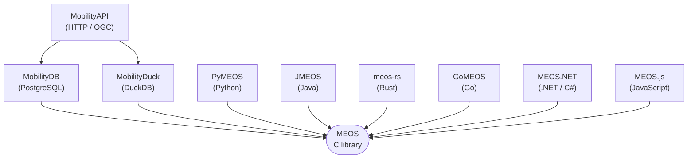

MEOS exposes its type system through bindings tailored to each host environment. Pick the binding that matches your stack.

## Architecture

The C library is the source of truth for type semantics, encoding, and behaviour. Each binding is a language- or system-specific surface over the same underlying types — values written from one binding are readable from any other via the shared [encoding formats](/movingfeaturesformats/).

## Database bindings

These bindings expose MEOS types as first-class types of a database or query engine, with full SQL support, indexing, and aggregation.

* **[PostgreSQL → MobilityDB](mobilitydb/)**
* **[DuckDB → MobilityDuck](mobilityduck/)**

## HTTP / OGC API

This surface exposes MEOS-stored data over plain HTTP using the OGC API – Moving Features standard. Use it when the consumer is a browser, mobile client, or other HTTP-driven application that doesn't speak SQL.

* **[MobilityAPI](mobilityapi/)**

## Language bindings

These bindings expose MEOS to general-purpose programming languages. Use them when you want to manipulate temporal data in application code rather than inside a database.

* **[Python → PyMEOS](pymeos/)**
* **[Java → JMEOS](jmeos/)**
* **[Rust → meos-rs](rustmeos/)**
* **[Go → GoMEOS](gomeos/)**
* **[.NET / C# → MEOS.NET](meosnet/)**
* **[JavaScript → MEOS.js](meosjs/)**

## Choosing a binding

| If you... | Use |
|---|---|
| have PostgreSQL in your stack | MobilityDB |
| use DuckDB or want embedded analytics | MobilityDuck |
| serve trajectories over HTTP / REST (OGC API) | MobilityAPI |
| work in a Python notebook / data-science workflow | PyMEOS |
| build a Java / Kotlin / Scala / Clojure backend | JMEOS |
| build a Rust application | meos-rs |
| build a Go service | GoMEOS |
| build a .NET / Unity / desktop application | MEOS.NET |
| target the browser or Node.js | MEOS.js |

Bindings can be combined. A typical setup might use MobilityDB to store and query trajectories, PyMEOS to analyse them in a Jupyter notebook, and MEOS.js to visualise results in the browser. All three exchange data using MEOS's [encoding formats](/movingfeaturesformats/).

## For binding contributors — page template

Each binding has its own page in `content/bindings/`. Pages share a common template so readers moving between them see consistent structure:

1. **Opening paragraph** — name the binding, the host language or query engine, the FFI idiom (CFFI, JNR-FFI, CGO, P/Invoke, WebAssembly, etc.), and one or two sentences on target use cases.
2. **`## Resources` section** — a bulleted list with consistent field names: `GitHub`, `Documentation`, `Project site`, `Examples`. Include the fields that apply; omit the rest.
3. **Optional richer sections** — `Overview`, `Installation`, `Usage example`, etc. Add them where there is content for them; absence is fine. The Rust page (`rustmeos.md`) is the example of a richer page that supplements rather than conflicts with the template.

When writing the opening paragraph, keep wording neutral about implementation details that may change across binding-internal refactors (concrete FFI library, dependency versions, etc.).
